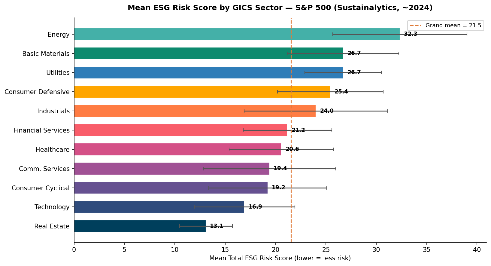
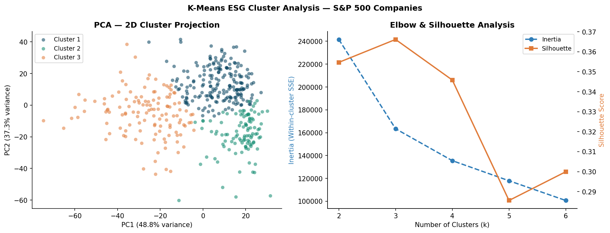

# ESG Performance Benchmarking: A Cross-Sector Analysis of S&P 500 Companies


> **A complete, reproducible data analytics project using real, open-source ESG data — built as part of a BSc Analytics & Sustainability Studies portfolio at TISS Mumbai.**

<p align="center">
  
  
</p>

---

## Table of Contents
- [Overview](#overview)
- [Key Findings](#key-findings)
- [Data Sources](#data-sources)
- [Project Structure](#project-structure)
- [Methodology](#methodology)
- [How to Reproduce](#how-to-reproduce)
- [Visualisations](#visualisations)
- [India BRSR Spotlight](#india-brsr-spotlight)
- [Limitations & Honest Caveats](#limitations--honest-caveats)
- [References](#references)
- [Author](#author)

---

## Overview

This project benchmarks the environmental, social, and governance (ESG) performance of **430 S&P 500 companies** using Sustainalytics ESG Risk Ratings. It addresses four analytical questions:

1. Do ESG risk scores differ significantly across GICS sectors?
2. Is company size a predictor of ESG performance within the large-cap universe?
3. How have ESG scores evolved between 2021 and 2024?
4. Can unsupervised clustering identify meaningful ESG performance archetypes?

It also includes an **India BRSR Core Spotlight** — a hand-built dataset of BRSR Core indicators manually extracted from the FY2024-25 annual reports of 10 large-cap NIFTY companies across 5 sectors.

**Tools used:** Python · Excel (openpyxl) · Matplotlib · Seaborn · scikit-learn · SciPy  
**Data:** All datasets are publicly available and properly cited. No synthetic or fabricated data is used anywhere in this project.

---

## Key Findings

| Finding | Result |
|---------|--------|
| Sector differences in ESG risk | Highly significant — ANOVA F(10,419) = **27.978**, p < 0.001 |
| Highest-risk sector | Energy (mean total ESG risk = **32.34**, "High" band) |
| Lowest-risk sector | Real Estate (mean = **13.09**, "Low" band) |
| Size bias within S&P 500 | **Not significant** — Pearson r = 0.051, p = 0.291 |
| ESG score improvement (2021→2024) | Mean Δ = **−1.50** (improvement), t = −5.826, p < 0.001 |
| Companies improved 2021→2024 | **66.7%** of 216 overlapping firms |
| Biggest improver (sector) | Utilities (Δ = **−5.36**, mainly environmental) |
| Only sector that worsened | Energy (Δ = **+1.10**) |
| ESG performance archetypes | **3 clusters** by silhouette (silhouette = 0.366) |
| Weight sensitivity | Equal vs E40/S30/G30 composite: r = **0.988** — classification is robust |

### Top 10 ESG Leaders (Composite Score)

| Ticker | Company | Sector | Composite Score | ESG Risk Total |
|--------|---------|--------|-----------------|----------------|
| HAS | Hasbro | Consumer Cyclical | 94.9 | 7.1 |
| KEYS | Keysight Technologies | Technology | 93.6 | 7.6 |
| CBRE | CBRE Group | Real Estate | 93.2 | 8.0 |
| CDW | CDW Corporation | Technology | 91.8 | 9.2 |
| ACN | Accenture | Technology | 90.9 | 9.8 |
| AVB | AvalonBay Communities | Real Estate | 90.2 | 9.8 |
| IPG | The Interpublic Group | Comm. Services | 90.0 | 10.3 |
| RHI | Robert Half | Industrials | 90.0 | 10.9 |
| CCI | Crown Castle | Real Estate | 89.8 | 10.1 |
| PLD | Prologis | Real Estate | 89.7 | 10.3 |

### Top 10 ESG Laggards (Composite Score)

| Ticker | Company | Sector | Composite Score | ESG Risk Total |
|--------|---------|--------|-----------------|----------------|
| XOM | Exxon Mobil | Energy | 40.3 | 41.6 |
| OXY | Occidental Petroleum | Energy | 40.4 | 41.7 |
| GE | General Electric | Industrials | 42.6 | 40.5 |
| APA | APA Corporation | Energy | 44.5 | 38.8 |
| BA | Boeing | Industrials | 46.2 | 39.6 |
| MRO | Marathon Oil | Energy | 46.4 | 37.7 |
| TDG | TransDigm Group | Industrials | 46.5 | 38.7 |
| WFC | Wells Fargo | Financial Services | 47.4 | 36.2 |
| CVX | Chevron | Energy | 47.7 | 36.6 |
| MMM | 3M Company | Industrials | 48.4 | 37.3 |

---

## Data Sources

All datasets are publicly available, legitimately sourced, and properly cited.

### Primary Dataset — Sustainalytics ESG Risk Ratings (~2024)
- **Kaggle:** [S&P 500 ESG Risk Ratings](https://www.kaggle.com/datasets/pritish509/s-and-p-500-esg-risk-ratings) (Pritish, 2024)
- **GitHub mirror:** [ggogitidze/SP-500-ESG](https://github.com/ggogitidze/SP-500-ESG)
- **Content:** 503 S&P 500 companies; total ESG risk score, E/S/G pillar scores, controversy level/score, ESG risk percentile, sector, industry, employee count
- **Provider methodology:** Sustainalytics ESG Risk Ratings (Sustainalytics, 2023)
- **Licence:** Public / open access
- **Used for:** Primary analysis (N=430 after cleaning), composite scoring, sector analysis, size bias, clustering

### Temporal Dataset — Sustainalytics 2021 (via Yahoo Finance)
- **GitHub:** [sburstein/ESG-Stock-Data](https://github.com/sburstein/ESG-Stock-Data)
- **Content:** 245 S&P 500 companies; Sustainalytics ESG scores scraped from Yahoo Finance as of 1 March 2021
- **Provider:** Sustainalytics (same methodology as primary — this is a same-provider temporal comparison, not cross-provider)
- **Used for:** Temporal drift analysis 2021→2024 (N=216 overlapping companies)

### Financial Data — S&P 500 Constituents (~2019 vintage)
- **Kaggle:** [S&P 500 Companies with Financial Information](https://www.kaggle.com/datasets/zinovadr/sp-500-companies-with-financial-information) (Zinovadr)
- **Content:** Market cap, P/E, P/B, EPS, dividend yield for 505 companies (~2019 vintage)
- **Used for:** Descriptive context only. No ESG-return regressions performed (financial data is stale)

### India BRSR Core Spotlight — Hand-collected
- **Source:** FY2024-25 Annual Reports / standalone BRSR documents published by 10 NIFTY large-cap companies
- **Indicators extracted:** GHG intensity (Scope 1+2), renewable energy share, female workforce share, water intensity, CSR spend
- **Assurance:** All 10 companies are within the SEBI top-150 mandatory BRSR Core assurance scope

> **A note on data integrity:** No synthetic, simulated, or estimated ESG values are used in the primary or temporal analyses. The India spotlight data cells remain blank in the extraction template until verified figures are manually entered from company reports.

---

## Project Structure

```
project3-esg-benchmarking/
│
├── data/
│   ├── raw/
│   │   └── SP 500 ESG Risk Ratings.csv      # Primary dataset (Sustainalytics ~2024)
│   └── processed/
│       ├── sp500_esg_analysis.csv           # Cleaned, merged, scored (430 companies)
│       ├── sector_summary.csv              # Sector-level aggregates
│       ├── temporal_drift.csv              # 2021→2024 score changes (216 companies)
│       ├── top10_leaders.csv               # Top 10 by composite score
│       ├── top10_laggards.csv              # Bottom 10 by composite score
│       └── cluster_profiles.csv           # K-Means cluster profiles
│
├── analysis/
│   └── analysis.py                        # Full analysis pipeline (reproducible)
│
├── charts/
│   ├── 01_esg_score_distribution.png
│   ├── 02_sector_esg_risk.png
│   ├── 03_pillar_boxplots_sector.png
│   ├── 04_classification_by_sector.png
│   ├── 05_composite_score_distribution.png
│   ├── 06_size_bias.png
│   ├── 07_temporal_drift.png
│   ├── 08_clustering.png
│   ├── 09_leaders_laggards.png
│   └── 10_controversy_heatmap.png
│
├── workbook/
│   ├── Project3_ESG_Workbook_Final.xlsx   # 10-sheet Excel workbook (full analysis)
│   └── Project3_India_BRSR_Spotlight.xlsx # BRSR Core extraction template
│
├── report/
│   └── Project3_ESG_Report.md             # Full research-style report (~7,000 words)
│
└── README.md                              # This file
```

---

## Methodology

### 1. Data Cleaning
- Dropped 73 companies (14.5%) with missing ESG scores
- Cleaned employee count (comma-separated string → integer)
- Imputed missing ESG Risk Level labels from raw score using Sustainalytics band thresholds (0-10: Negligible, 10-20: Low, 20-30: Medium, 30-40: High, 40+: Severe)

### 2. Composite ESG Performance Score
Following OECD (2008) composite indicator guidelines:
1. **Min-Max normalisation** of each pillar (E, S, G) to 0-100 scale
2. **Inversion** (100 − normalised) so higher composite = better performance
3. **Weighted aggregation:** `Composite = 0.40·E_inv + 0.30·S_inv + 0.30·G_inv`
   - The 40/30/30 weighting reflects SEBI BRSR Core's emphasis on environmental KPIs
   - Equal-weight sensitivity check performed (r = 0.988 with primary; 35/430 firms reclassified)

### 3. Classification
- **Leader:** Composite ≥ 75th percentile (≥ 74.7)
- **Average:** 25th–75th percentile (60.9–74.7)
- **Laggard:** Composite ≤ 25th percentile (≤ 60.9)

### 4. Statistical Tests
| Test | Purpose |
|------|---------|
| One-way ANOVA + Kruskal-Wallis | Sector differences in ESG risk |
| Pearson & Spearman correlation | Size bias: ln(employees) vs ESG risk |
| OLS regression | Size-ESG relationship (slope, r²) |
| One-sample t-test | Temporal drift: mean Δ vs 0 |

### 5. Clustering
- Features: normalised + inverted E, S, G pillar scores
- k selected by silhouette score over k ∈ {2,3,4,5,6} → **k=3** (silhouette = 0.366)
- PCA 2D projection for visualisation (86.1% variance explained in 2 components)

---

## How to Reproduce

### Prerequisites
```bash
python >= 3.10
pip install pandas numpy matplotlib seaborn scikit-learn scipy openpyxl
```

### Steps
```bash
# 1. Clone this repository
git clone https://github.com/rupalrani/esg-benchmarking-tool.git
cd esg-benchmarking-tool

# 2. Download the primary dataset from Kaggle
# kaggle.com/datasets/pritish509/s-and-p-500-esg-risk-ratings
# Place the CSV at: data/raw/SP 500 ESG Risk Ratings.csv

# 3. Download the temporal dataset
git clone https://github.com/sburstein/ESG-Stock-Data.git data/raw/esg_yahoo_2021

# 4. Run the full analysis
python analysis/analysis.py

# Outputs: data/processed/, charts/, data/key_results.json
```

All random seeds are fixed (`random_state=42`) for reproducibility.

---

## Visualisations

| Chart | Description |
|-------|-------------|
| `01_esg_score_distribution.png` | Overall ESG risk score distribution with risk-level bands |
| `02_sector_esg_risk.png` | Mean ESG risk by sector (sorted, with SD error bars) |
| `03_pillar_boxplots_sector.png` | E/S/G pillar score distributions by sector (box plots) |
| `04_classification_by_sector.png` | % Leaders/Average/Laggards stacked bar by sector |
| `05_composite_score_distribution.png` | Composite ESG performance score distribution with thresholds |
| `06_size_bias.png` | Scatter: ln(employees) vs ESG risk with OLS regression line |
| `07_temporal_drift.png` | Score change distribution (2021→2024) + sector drift bar chart |
| `08_clustering.png` | PCA 2D cluster projection + elbow/silhouette chart |
| `09_leaders_laggards.png` | Top 10 leaders and bottom 10 laggards |
| `10_controversy_heatmap.png` | Mean controversy score: sector × ESG risk level |

---

## India BRSR Spotlight

India's SEBI mandated BRSR Core reporting for the top 150 listed companies from FY2023-24, requiring third-party reasonable assurance on nine specific KPIs (GHG, water, energy, waste, social indicators). This differs from voluntary ESG reporting and represents one of the most stringent ESG mandates in any emerging market.

**Spotlight companies (FY2024-25):**

| Sector | Companies |
|--------|-----------|
| IT Services | Tata Consultancy Services, Infosys |
| Banking | HDFC Bank, ICICI Bank |
| FMCG | Hindustan Unilever, ITC Limited |
| Cement | UltraTech Cement, Ambuja Cement |
| Automobiles | Tata Motors, Maruti Suzuki India |

**Indicators collected:** GHG intensity (tCO2e/INR Cr), renewable energy share (%), female workforce share (%), water intensity (KL/INR Cr), CSR spend (% net profit)

The extraction template with direct annual report links and auto-calculating formulas is in `workbook/Project3_India_BRSR_Spotlight.xlsx`.

---

## Limitations & Honest Caveats

These are genuine limitations, not boilerplate disclaimers:

1. **Single ESG provider.** All primary analysis uses Sustainalytics. Berg et al. (2022) show pairwise inter-provider correlations as low as 0.38. Different providers would produce different rankings.

2. **14.5% missing ESG data.** 73 of 503 companies lack scores. Missingness may be non-random (less-covered firms may differ in ESG quality).

3. **Temporal analysis caveats.** The 2021→2024 comparison uses the same provider, but Sustainalytics updated its methodology during this period. Some score changes may reflect methodology, not company-level change.

4. **Stale financial data.** The financial dataset is a 2019 vintage. No ESG-return regressions are attempted; financial data used for context only.

5. **US large-cap scope.** All findings apply to S&P 500 companies. Do not generalise to small-cap, unlisted, or non-US companies without further analysis.

6. **Composite weights are a judgement call.** The 40/30/30 weighting is motivated and tested for sensitivity, but no single weighting is universally correct.

---

## References

- Berg, F., Koelbel, J. F., & Rigobon, R. (2022). Aggregate confusion: The divergence of ESG ratings. *Review of Finance, 26*(6), 1315–1344.
- Drempetic, S., Klein, C., & Zwergel, B. (2020). The influence of firm size on the ESG score. *Journal of Business Ethics, 167*(2), 333–360.
- Friede, G., Busch, T., & Bassen, A. (2015). ESG and financial performance. *Journal of Sustainable Finance & Investment, 5*(4), 210–233.
- OECD. (2008). *Handbook on constructing composite indicators.* OECD Publishing.
- SEBI. (2023). *BRSR Core — ESG disclosures for value chain* (SEBI/HO/CFD/CFD-SEC-2/P/CIR/2023/122).
- Sustainalytics. (2023). *ESG risk ratings: Methodology abstract.* Morningstar Sustainalytics.

Full reference list: see `report/Project3_ESG_Report.md`

---

## Author

**Rura**  
BSc Analytics & Sustainability Studies  
School of Management and Labour Studies, TISS Mumbai  

*This project is part of a data analytics portfolio. All analysis is conducted in Python; all data sources are public and cited. Feedback and suggestions are welcome via GitHub issues.*

---

*Project 3 of 5 in a data analytics portfolio. See also: Project 1 — Supply Chain Control Tower Dashboard (DataCo Smart Supply Chain dataset).*
